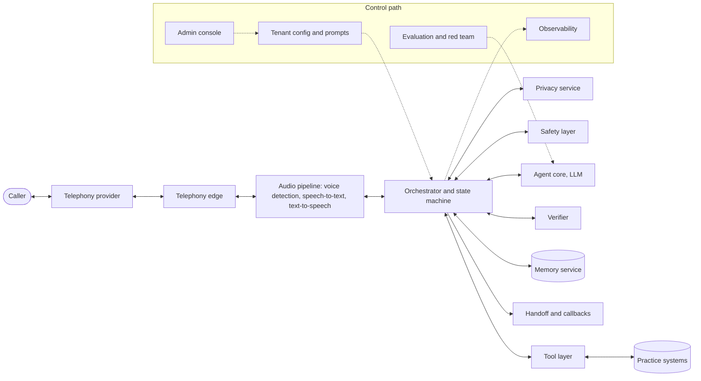
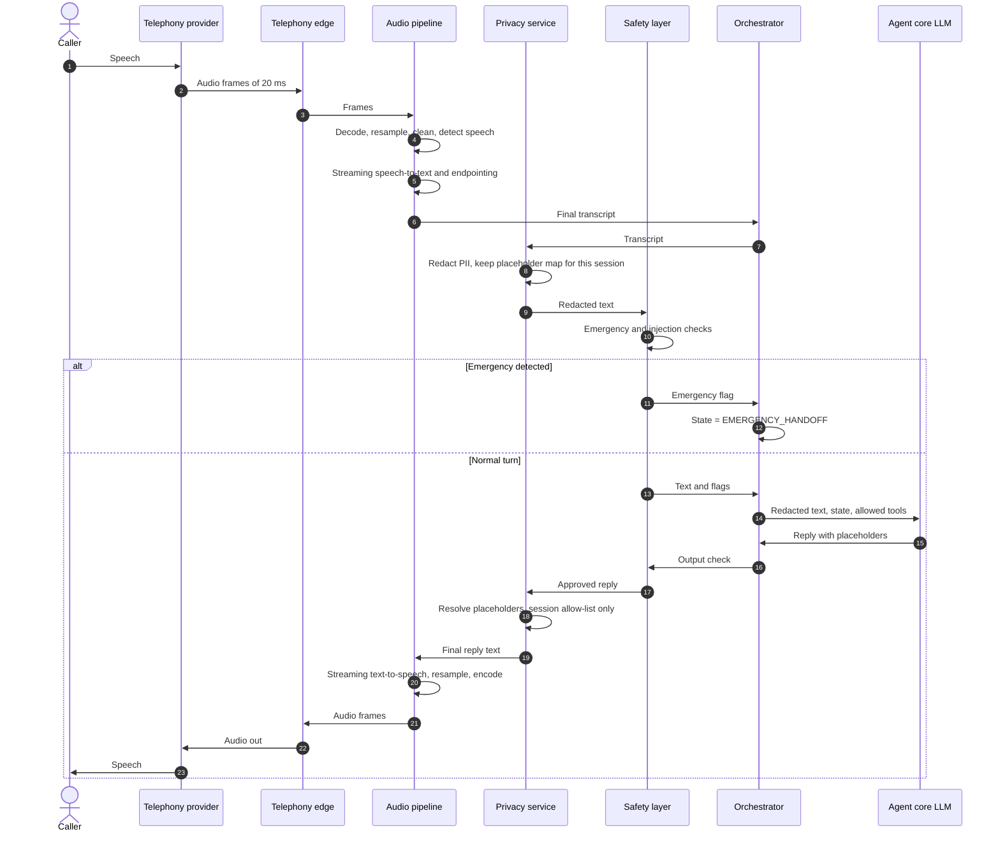
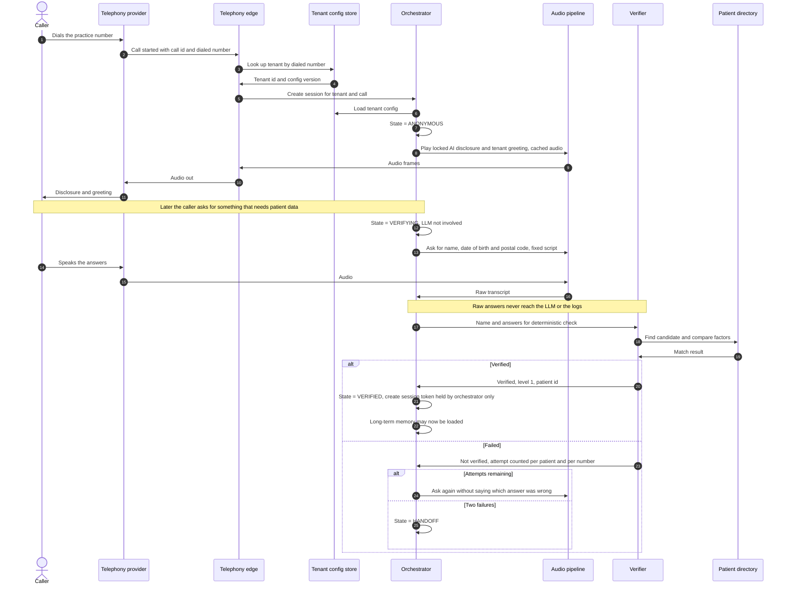
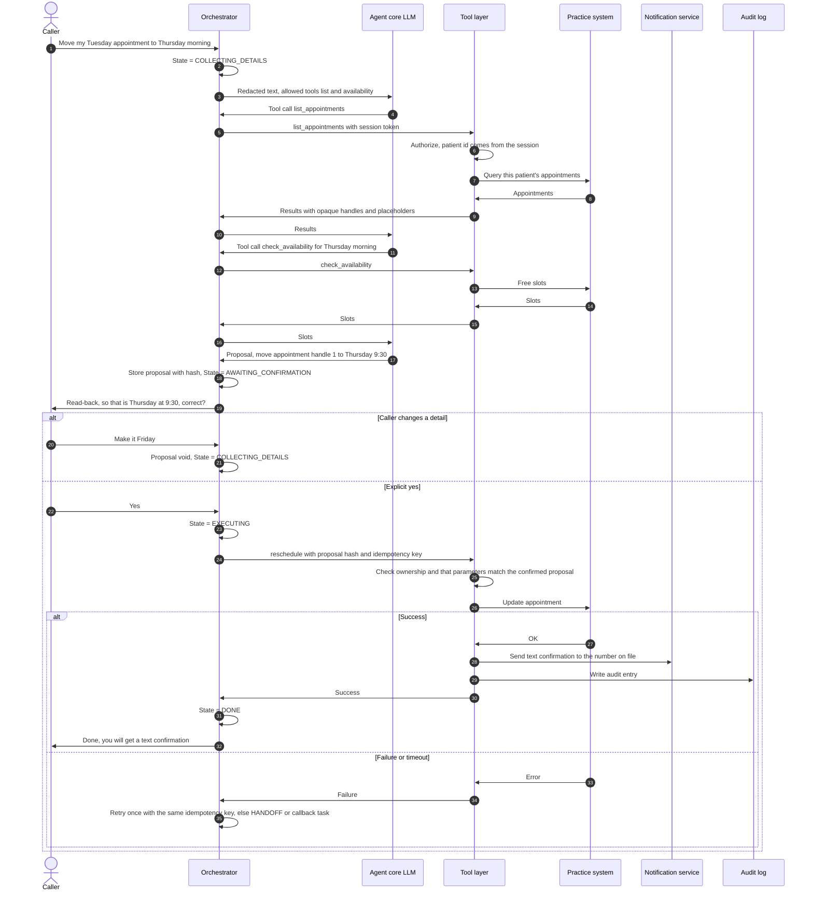
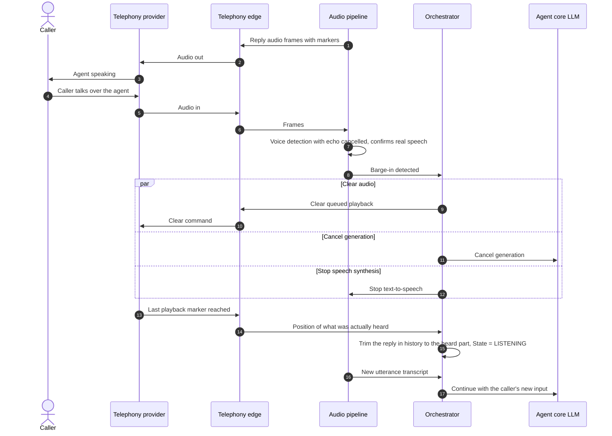
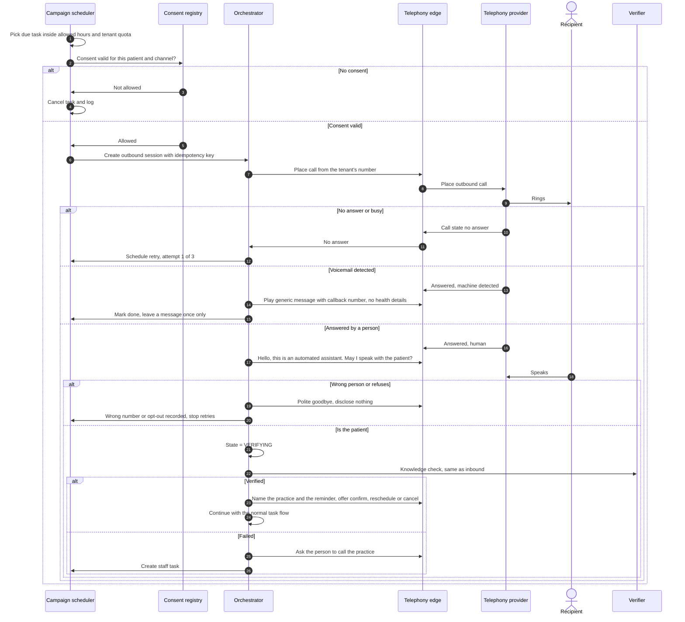

# System Overview

Status: draft v0.1, for review. Decisions come from `docs/DESIGN.md` (tags decided / proposed / open).

## 1. Purpose and scope

A multi-tenant phone assistant for healthcare practices. Patients call (inbound) or are called (outbound reminders). The assistant handles inquiries, booking, rescheduling and cancelling for existing patients, hands over to a human when needed, and gives practice admins transcripts, control and analytics.

Two halves:
- **Real-time path (per call):** audio in, decisions, audio out. Every millisecond counts.
- **Control path (per tenant):** configuration, admin console, evaluation, monitoring.

## 2. Component map

This is a structure diagram. The sequence diagrams below show behavior over time.

## 3. Design rules that shape every diagram

1. The LLM proposes, the state machine disposes. Guardrails are enforced in code.
2. Raw PII never reaches the LLM or the logs. Redaction on input, opaque per-session placeholders on output.
3. Verification runs in a deterministic verifier outside the LLM. The LLM only learns "verified, level".
4. The session token is held by the orchestrator, never by the model.
5. The tool layer decides what is reachable. The patient ID comes from the session, and every object is checked for ownership.
6. A confirmation is bound to one exact proposal. Any change voids it.
7. Every write carries an idempotency key and produces an audit entry.
8. Emergency, "human please" and hang-up work from any state.
9. Tenant configuration can tighten platform rules but never loosen them.

## 4. Sequence diagrams

### 4.1 One conversational turn (audio path)

Every turn in the other diagrams travels this path. While the state is VERIFYING, the transcript goes to the verifier instead of the LLM (see 4.2).

### 4.2 Inbound call: connect and verify

### 4.3 Inbound call: reschedule with confirmation

Each message to or from the caller travels the turn path in 4.1.

### 4.4 Barge-in

### 4.5 Outbound reminder call

## 5. Component designs (one file each, summary plus detail)

| # | Component | File | Status |
|---|---|---|---|
| 1 | Telephony edge | 01-telephony-edge.md | not started |
| 2 | Audio and turn-taking pipeline | 02-audio-pipeline.md | not started |
| 3 | Session and conversation state | 03-session-state.md | not started |
| 4 | Privacy pipeline | 04-privacy.md | not started |
| 5 | Identity and verification | 05-verification.md | not started |
| 6 | Agent core | 06-agent-core.md | not started |
| 7 | Tools and practice-system integration | 07-tools-integration.md | not started |
| 8 | Safety and guardrails | 08-safety.md | not started |
| 9 | Human handoff and callbacks | 09-handoff.md | not started |
| 10 | Long-term memory | 10-memory.md | not started |
| 11 | Outbound campaigns | 11-outbound.md | not started |
| 12 | Tenant configuration and prompts | 12-tenant-config.md | not started |
| 13 | Admin console and analytics | 13-admin-console.md | not started |
| 14 | Evaluation and testing | 14-evaluation.md | not started |
| 15 | Observability | 15-observability.md | not started |
| 16 | Capacity, resilience and cost | 16-capacity-resilience.md | not started |
| 17 | Security, compliance, data lifecycle | 17-security-compliance.md | not started |
| 18 | Deployment and rollout | 18-deployment.md | not started |

## 6. Open questions

- Latency budget per hop for the turn path in 4.1. [open]
- Whether privacy and safety run in-process with the orchestrator or as separate services (latency against isolation). [open]
- Where per-call state is stored and how a dropped call is resumed. [open]
- Telephony, speech and LLM providers. [open]
